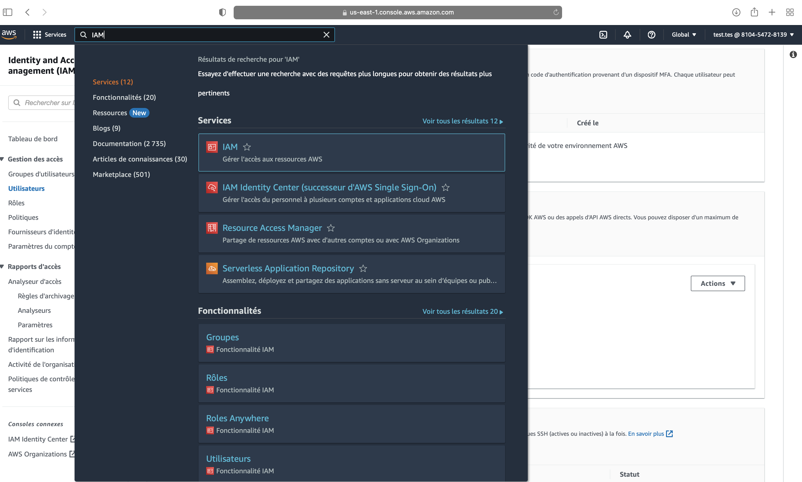

# Prérequis - EKS

## Installations
Vous devez installer sur votre poste de travail les deux outils suivants:

[AWS CLI](https://docs.aws.amazon.com/fr_fr/cli/latest/userguide/getting-started-install.html) et [kubectl](https://kubernetes.io/fr/docs/tasks/tools/install-kubectl/)

## Configuration AWS

La première étape consiste à recuperer vos clef api AWS.

* identifier vous à la [console AWS](https://810454728139.signin.aws.amazon.com/console) avec les credentials fournis.

* Selectionner le service IAM 



* Sur la page du service IAM, selectionner l'onglet **utilisateurs**, puis votre identifiant aws.


* Selectionner l'onglet **information d'identification de sécurité**


* Cliquer sur  **Créer un clef daccès**


Une fois les clef d'accès générés, il vous faut configurer [AWS CLI](https://docs.aws.amazon.com/fr_fr/cli/latest/userguide/getting-started-install.html)

* editer le fichier `$HOME/.aws/config` - si il n'existe pas créer le. 

* dans le fichier `$HOME/.aws/config`, créer un nouveau profile **talan_formation**
```bash
[talan_formation]
region=eu-west-3
output=json
``` 

* editer le fichier `$HOME/.aws/credentials` - si il n'existe pas créer le.

* dans le fichier `$HOME/.aws/config`, copier les clés d'accès que vous avez généré. 

```bash
[talan_formation]
aws_access_key_id = AK************************
aws_secret_access_key = 0hQj************************
```


## Configuration kubernetes


Dans un terminal, exécuter:

```
export AWS_PROFILE=talan_formation
aws eks update-kubeconfig --name formation-eks --region eu-west-3
kubectl config set-context --current --namespace=#PRENOM-NOM#
```

> Par exemple: `kubectl config set-context --current --namespace=bertrand-nau`
