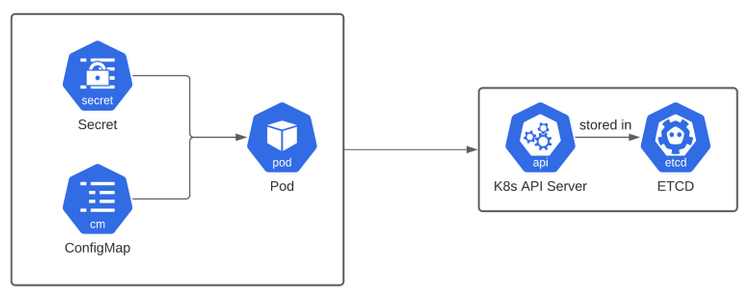

# Découpler la configuration

## Objectif 

* comprendre la différence entre un configmap et un secret
* manipuler et utiliser les configmap et secrets


## Configmap et Secret



## Configmap 

Création d'un configmap `app-config` pour stocker la clé/valeur `PORT=4000`  

```bash
kubectl create configmap app-config --from-literal=PORT=4000 --dry-run=client -o yaml > config.yaml

apiVersion: v1
data:
  PORT: "3000"
kind: ConfigMap
metadata:
  creationTimestamp: null
  name: language

```

```bash
k create -f config.yaml

configmap/app-config created
```

Lister les configmaps

```bash
k get configmaps

NAME               DATA   AGE
app-config         1      97s
kube-root-ca.crt   1      4d18h
```

Afficher le contenu d'un confimap

```bash
Name:         app-config
Namespace:    default
Labels:       <none>
Annotations:  <none>

Data
====
PORT:
----
4000

BinaryData
====

Events:  <none>
```


Associer un configmap à un container

```yaml
apiVersion: v1
kind: Pod
metadata:
  name: test-env
spec:
  containers:
    - name: test-env
      image: gcr.io/google_containers/busybox
      command: [ "/bin/sh", "-c", "env" ]
      env:
        - name: PORT
          valueFrom:
            configMapKeyRef:
              name: app-config
              key: PORT
  restartPolicy: Never
```

> Nb: cette image affiche les variables d'environnement et s'arrête immédiatement

```bash
k create -f pod.yaml
```

NB : En cas d'erreur, `k describe pod test-env` 


Regardez les logs du containeur

```bash
k logs test-env

KUBERNETES_PORT=tcp://172.17.0.1:443
KUBERNETES_SERVICE_PORT=443
MYNGINX_PORT_80_TCP=tcp://172.17.24.238:80
HOSTNAME=busybox
SHLVL=1
HOME=/root
PORT=4000
MYNGINX_SERVICE_HOST=172.17.24.238
TERM=xterm
```
On a bien la variable d'environnement `PORT` qui a été ajoutée 


## Secret 


Créer un secret `apikey` avec une valeur à ne pas divulguer

```bash
k create secret generic apikey --from-literal=API_KEY=123–456 --dry-run=client -o yaml > secret.yaml
```

```bash
k create -f secret.yaml

secret/apikey created
```

Afficher le secret 

```bash
k get secret apikey

NAME     TYPE     DATA   AGE
apikey   Opaque   1      8s
```

> Nb: le type est `Opaque` 

Afficher le contenu du secret

```bash
k describe secret apikey
Name:         apikey
Namespace:    default
Labels:       <none>
Annotations:  <none>

Type:  Opaque

Data
====
API_KEY:  9 bytes
```

> On ne voit pas le contenu du secret généré


Injectons le secret dans un container 

```yaml
apiVersion: v1
kind: Pod
metadata:
  name: test-env
spec:
  containers:
    - name: test-env
      image: gcr.io/google_containers/busybox
      command: [ "/bin/sh", "-c", "env" ]
      env:
      - name: API_KEY
        valueFrom:
            secretKeyRef:
              name: apikey
              key: API_KEY
  restartPolicy: Never
```

Affichage des logs

```bash
k logs test-env
KUBERNETES_SERVICE_PORT=443
MYNGINX_PORT_80_TCP=tcp://172.17.24.238:80
KUBERNETES_PORT=tcp://172.17.0.1:443
HOSTNAME=test-env
SHLVL=1
HOME=/root
MYNGINX_SERVICE_HOST=172.17.24.238
TERM=xterm
KUBERNETES_PORT_443_TCP_ADDR=172.17.0.1
PATH=/usr/local/sbin:/usr/local/bin:/usr/sbin:/usr/bin:/sbin:/bin
KUBERNETES_PORT_443_TCP_PORT=443
MYNGINX_SERVICE_PORT=80
MYNGINX_PORT=tcp://172.17.24.238:80
KUBERNETES_PORT_443_TCP_PROTO=tcp
API_KEY=123–456
```

!NB : la valeur du secret est visible ! D'où l'importance de limiter les droits dans un cluster...


## Exercice

L'image du `backend` de l'application a été déployée sur un registry ECR. Son nom est: `810454728139.dkr.ecr.eu-west-3.amazonaws.com/k8-chatroulette-back:latest`
Elle contient un backend qui expose un endpoint sur le port `3000` sur le path `/version`

Le endpoint `/version` lit la variable environment `APP_VERSION`.

* Exporter la variable d'environnement `APP_VERSION` dans une configmap et l'injecter dans le pod `backend` 
* Appeler l'endpoint `/version`
* Modifier la valeur de la variable d'environnement avec la commande `kubectl patch` ou en modifiant le fichier de description de la configmap
* Le pod retourne l'ancienne variable d'environnement. Pourquoi?
* Redémarrer le deployment avec la commande `kubectl rollout restart`


## A retenir

* les configmap et secret sont essentiels pour faire tourner un code immuable dans x environnements
* attention, un secret n'est pas secret si on peut le décoder... 
