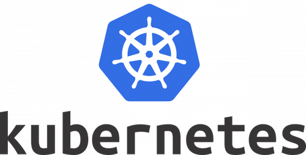

# Formation K8 pour développeurs

## Statut 

Work In progress 

## Objectif 

Comprendre et manipuler les composants principaux d'un cluster Kubernetes en déployant des applications

Durée : 2 jours

## Etapes 

* [Rappel des bases des containers](./0_container.md)
* [K8 core contep](./0_k8.md)
* [Prérequis pour EKS](./0_prerequisities_eks.md)
* [Configuration et outils d'un cluster](./1_cluster.md)
* [Exécuter des container dans des pods](./2_pod.md)
* [Déploiement d'un pod](./3_deploy.md)
* [Service discovery](./4_service.md)
* [Configmap et secrets](./5_config.md)
* [Volumes](./6_volumes.md)
* [Volumes persistants](./7_persistentvolumes.md)
* [Ingress controller](./8_ingress.md)
* [Tooling et écosystème](./9_tools.md)
* [Sécurité](./10_security.md)

